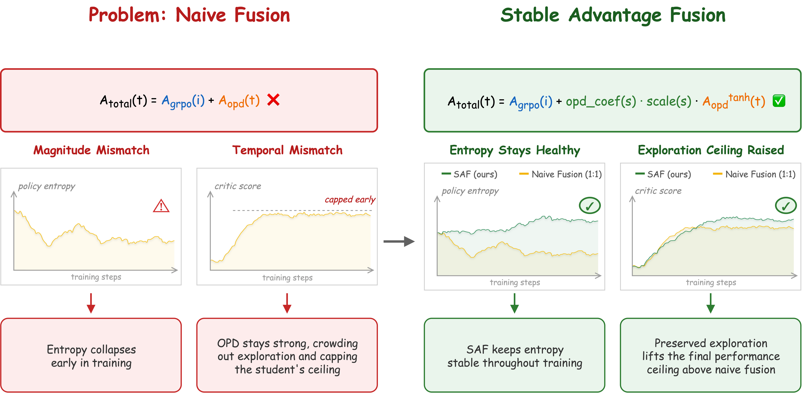
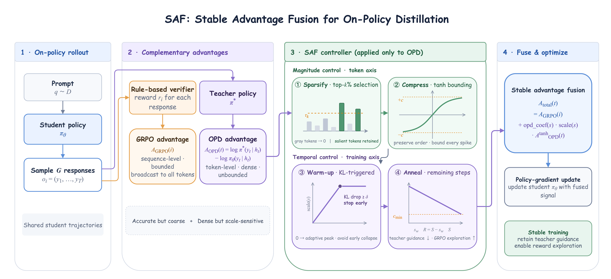

# SAF-OPD

📄 **Paper:** [**SAF-OPD: Stable Advantage Fusion for On-Policy Distillation**](https://arxiv.org/abs/2607.29209) (arXiv, July 2025)

**SAF** (Stable Advantage Fusion) is a lightweight, four-stage framework for fusing a response-level RLVR (GRPO) advantage with a token-level On-Policy Distillation (OPD) advantage. Reinforcement learning with verifiable rewards (RLVR) broadcasts a single response-level reward to every token, while on-policy distillation (OPD) scores each token against a stronger teacher for a dense advantage but caps performance at teacher quality. Naive fixed-coefficient fusion of the two suffers from a **magnitude mismatch** (unbounded token-level OPD advantages can spike far beyond the bounded GRPO advantage and erase its signal) and a **temporal mismatch** (sustained full-strength OPD keeps pulling the student toward the teacher and limits exploration needed to surpass it). SAF resolves both issues via a sparsify-then-compress mechanism for magnitude control and a warm-up-then-anneal mechanism for temporal control, with each stage independently switchable and adding negligible overhead. Across seven mathematical reasoning and code generation benchmarks with Qwen3-1.7B/4B/8B, SAF achieves 0.51–2.70% aggregate improvements, avoids entropy collapse, and consistently outperforms fixed-coefficient GRPO+OPD fusion.

<p align="center">
  
</p>
<p align="center">
  <em>Fixed-coefficient fusion versus SAF. SAF pairs the OPD advantage's magnitude and temporal mismatches with dedicated control mechanisms, avoiding entropy collapse, preserving exploration, and improving final performance.</em>
</p>

---------

## News
- We release the training code for **SAF**, our stable advantage fusion framework for combining GRPO and on-policy distillation. For usage, please refer to [Training](#training).

## Installation
Our code is mainly based on [verl](https://github.com/volcengine/verl) (v0.6.1). To prepare the environment, please follow these steps:

```bash
conda create -n verl python==3.10
conda activate verl
cd verl/
USE_MEGATRON=0 bash scripts/install_vllm_sglang_mcore.sh
pip install math-verify
```

## Training

Our training uses the same code environment and datasets as our prior work on generalized on-policy distillation: **57K DeepMath** problems with difficulty $\geq 6$ for mathematical reasoning, and the **25K-problem Eurus-2-RL-Code** dataset for code generation. Student models are initialized from Qwen3-1.7B/4B/8B, with Qwen3-30B-A3B-Instruct-2507 as the teacher supplying token-level log-probabilities for the OPD advantage.

<p align="center">
  
</p>
<p align="center">
  <em>Overview of SAF. SAF modifies only the OPD branch through four stages before it is added to the unchanged GRPO advantage for the policy-gradient update.</em>
</p>

All SAF experiments are provided in `verl/examples/saf_opd/`:
- `run_qwen3-4b-saf-opd-mixed.sh` — GRPO / OPD-only / GRPO+OPD (fixed) / SAF on **mathematical reasoning** (DeepMath, difficulty $\geq 6$).
- `run_qwen3-4b-saf-opd-mixed-for-code.sh` — same four modes on **code generation** (Eurus-2-RL-Code).
- `run_qwen3-4b-saf-opd-mixed-for-opd.sh` — dedicated **OPD-only** configuration for mathematical reasoning (larger batch size, one rollout per prompt, following the paper's separate OPD-only setup).
- `run_qwen3-4b-saf-opd-mixed-for-code-opd.sh` — dedicated **OPD-only** configuration for code generation.
- `merge.sh` — merges FSDP-sharded actor checkpoints into a single HuggingFace-format model.

### Training modes

Each `*-mixed*` script is controlled by the `TRAIN_MODE` environment variable:

| `TRAIN_MODE` | Description |
| --- | --- |
| `grpo`  | GRPO-only (RL only). Advantage fusion disabled entirely. |
| `opd`   | OPD-only. `grpo_coef=0`, `opd_coef=1`, all SAF stages disabled. |
| `mixed` | GRPO + OPD fusion (default). With all SAF stages disabled this is the naive fixed-coefficient fusion baseline; enabling the SAF stage flags below turns it into full SAF. |

```bash
# GRPO-only
TRAIN_MODE=grpo bash verl/examples/saf_opd/run_qwen3-4b-saf-opd-mixed.sh

# OPD-only
TRAIN_MODE=opd bash verl/examples/saf_opd/run_qwen3-4b-saf-opd-mixed.sh

# GRPO+OPD, fixed 1:1 fusion (SAF stages disabled)
TRAIN_MODE=mixed GRPO_COEF=1.0 OPD_COEF=1.0 bash verl/examples/saf_opd/run_qwen3-4b-saf-opd-mixed.sh

# Full SAF (paper's selected hyperparameters)
TRAIN_MODE=mixed TOPK_PERCENT=20 TANH_COMPRESS=True TANH_COEF=0.1 \
    OPD_WARMUP_STEPS=100 KL_DROP_DELTA=0.2 OPD_ANNEAL=True \
    bash verl/examples/saf_opd/run_qwen3-4b-saf-opd-mixed.sh
```

The same environment variables apply to `run_qwen3-4b-saf-opd-mixed-for-code.sh` for code generation. Override `STUDENT_MODEL_PATH`, `TEACHER_MODEL_PATH`, `TRAIN_FILE`/`CODE_DATA_DIR`, `AIME24_TEST_PATH`, `AIME25_TEST_PATH`, `CHECKPOINT_DIR`, and `WANDB_PROJECT` as environment variables to point to your own paths.

### SAF's four independently switchable stages

Only meaningful when `TRAIN_MODE=mixed`. Composing all four stages in order (Stage 1 → Stage 2 → Stage 3 → Stage 4) and fusing with the unchanged GRPO advantage gives the final advantage used for policy optimization:

$$A_{i,t}^{\mathrm{total}} = A_i^{\mathrm{GRPO}} + \mathrm{opd\_coef}(s)\cdot\mathrm{scale}(s)\, A_{i,t}^{\mathrm{OPD,tanh}}$$

Disabling all four stages recovers the naive fixed fusion $A_i^{\mathrm{GRPO}}+A_{i,t}^{\mathrm{OPD}}$.

| Stage | Env var(s) | Description |
| --- | --- | --- |
| Stage 1 — Top-$k\%$ sparsification | `TOPK_PERCENT` | Per-sequence top-$k\%$ sparsification of `\|A_opd\|`; tokens below the $(1-k\%)$ quantile of their own sequence are zeroed. `100` disables filtering (default). Paper default: `20`. |
| Stage 2 — Bounded tanh compression | `TANH_COMPRESS`, `TANH_COEF` | `A_opd_tanh = TANH_COEF * tanh(A_opd)`, confines the OPD advantage to `(-TANH_COEF, TANH_COEF)`. Paper default: `TANH_COEF=0.1`. |
| Stage 3 — KL-triggered linear warm-up | `OPD_WARMUP_STEPS`, `KL_DROP_DELTA` | Linearly ramps the OPD coefficient from 0 to 1 over `OPD_WARMUP_STEPS` steps; terminates early once the relative student–teacher KL drop `(KL_0 - KL_t) / KL_0 >= KL_DROP_DELTA`. `OPD_WARMUP_STEPS=0` disables warm-up (also disables Stage 4). Paper default: `OPD_WARMUP_STEPS=100`, `KL_DROP_DELTA=0.2`. |
| Stage 4 — Linear annealing | `OPD_ANNEAL`, `ANNEAL_STEPS`, `ANNEAL_MIN`, `ANNEAL_TOTAL_STEPS` | Activates after warm-up ends (or from step 0 if warm-up is disabled) and linearly decays the OPD coefficient toward `ANNEAL_MIN` over the remaining training budget. `ANNEAL_TOTAL_STEPS` (optional) sets the combined warm-up + annealing budget, taking precedence over `ANNEAL_STEPS`. |

By default, the paper's four training modes are compared under a shared optimization/rollout configuration (`grpo`, `mixed` fixed fusion, and `mixed` full SAF), while `opd`-only uses a dedicated distillation configuration (batch size 1024, one rollout per prompt) provided by `run_qwen3-4b-saf-opd-mixed-for-opd.sh` and `run_qwen3-4b-saf-opd-mixed-for-code-opd.sh`.

### Merging checkpoints

After training, merge the FSDP-sharded actor checkpoint into a HuggingFace-format model for evaluation:

```bash
CHECKPOINT_PATH=checkpoints/saf-opd-math/mixed_opd1.0_topk20_tanh01_warmup100_kldelta02_anneal200/global_step_200/actor \
    bash verl/examples/saf_opd/merge.sh
```

## Benchmarks

SAF is evaluated on **7 benchmarks** across mathematical reasoning and code generation:

### Mathematical Reasoning (4 benchmarks)
- **AIME 2024** — American Invitational Mathematics Examination
- **AIME 2025** — American Invitational Mathematics Examination  
- **HMMT February 2025** — Harvard-MIT Math Tournament
- **HMMT November 2025** — Harvard-MIT Math Tournament

### Code Generation (3 benchmarks)
- **HumanEval+** — Extended HumanEval benchmark
- **MBPP+** — Extended MBPP benchmark
- **LiveCodeBench** — Competitive programming benchmark

## Evaluation

### Math Reasoning Evaluation
Math evaluation data is in the ``data/`` folder (AIME24, AIME25, HMMT25-Feb, HMMT25-Nov). Math evaluation code and script are in the ``math_eval/`` folder.

```bash
cd math_eval/
sh scripts/run_eval_math.sh
```

### Code Generation Evaluation
Our evaluation is mainly based on the code provided in [Absolute-Zero-Reasoner](https://github.com/LeapLabTHU/Absolute-Zero-Reasoner), covering HumanEval+, MBPP+, and LiveCodeBench.

#### EvalPlus

```bash
CUDA_VISIBLE_DEVICES=0 bash code_eval/scripts/run_evalplus.sh humaneval <MODEL_PATH>  0 1.0 1.0 4
```

#### LiveCodeBench

Download data first

```bash
git clone https://hf-mirror.com/datasets/livecodebench/code_generation_lite code_eval/coding/LiveCodeBench/code_generation_lite
```

Evaluation
```bash
bash code_eval/scripts/run_lcb_gen.sh --model Qwen3-4B-NonThinking --local_model_path  <MODEL_PATH>
```


## Acknowledgments
Our training code is mainly based on [verl](https://github.com/volcengine/verl). Our evaluation code is mainly based on [Absolute-Zero-Reasoner](https://github.com/LeapLabTHU/Absolute-Zero-Reasoner), which is built opon [EvalPlus](https://github.com/evalplus/evalplus) and [LiveCodeBench](https://github.com/LiveCodeBench/LiveCodeBench).


## Citation

If you find our work helpful, please kindly cite as:

```bibtex
@article{ding2025safopd,
  title={SAF-OPD: Stable Advantage Fusion for On-Policy Distillation},
  author={Ding, Yifan and Wei, Xincheng and Li, Yoshua Y. and Li, Ziheng and Lu, Yuquan and Zhang, Siyu and Ma, Dongsheng and Weng, Rongxiang and Cai, Xunliang and Chen, Yun},
  journal={arXiv preprint arXiv:2607.29209},
  year={2025}
}
```
